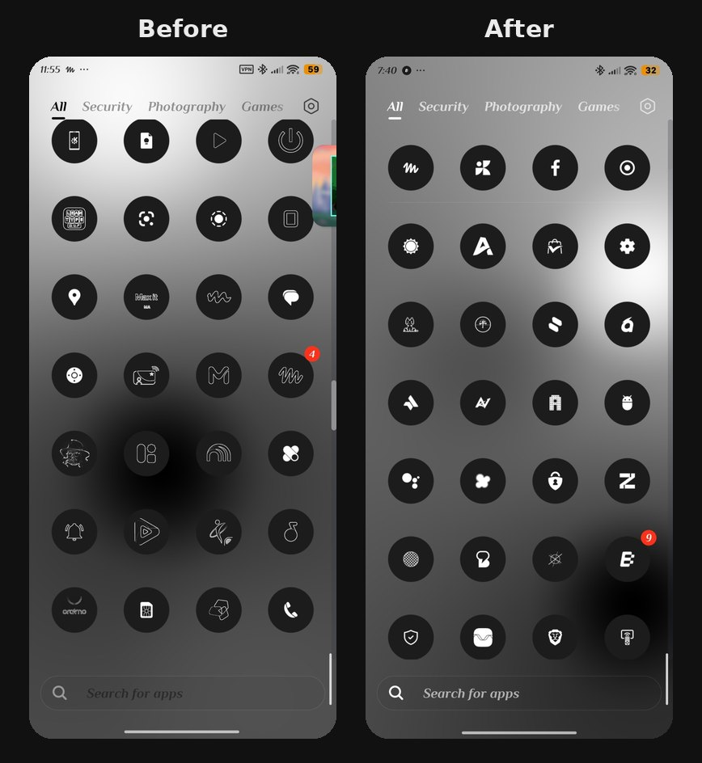
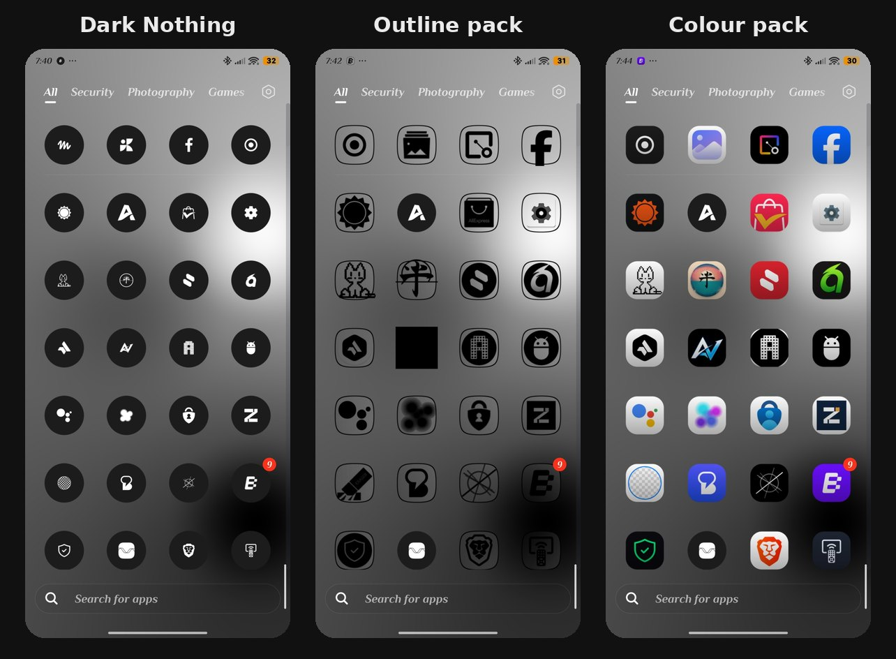
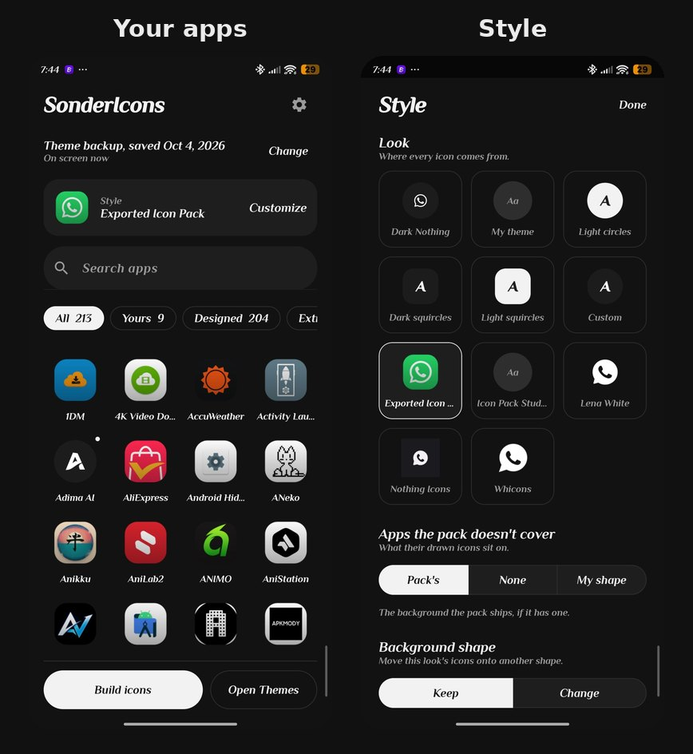

# SonderIcons

Every app on a HyperOS phone in one look. No root.

**For Xiaomi, Redmi and POCO phones on HyperOS. Needs [Shizuku](https://shizuku.rikka.app/).**



HyperOS themes ship hand-drawn icons for a fixed list of apps and trace an outline of
everything else. SonderIcons draws the rest to match — from each app's own monochrome
glyph where it has one — and lets you restyle the whole set.



## Features

- **Fill the gaps.** An icon for every app your look doesn't cover, drawn from the app's
  monochrome glyph, its shape, or its logo cut out of its icon.
- **Looks.** Dark Nothing (a designed set, built in), your applied theme, light and dark
  circles and squircles, a shape of your own, or any installed icon pack (Icon Pack
  Studio and other standard packs).
- **Reshape anything.** Move any look's icons onto another shape and keep their designs.
- **Per app.** Its own glyph, a gallery picture, an icon from any pack (suggested in one
  tap), its first letter, or the look's icon — with size, stroke, background and a home
  screen preview.
- **Groups.** Select apps by filter or search and change them together.
- **Quick toggles** in the look's colours or your own.
- **Extras.** Second icons and alternative icons (apps like Ente switch between several),
  pinned shortcuts, and how unknown icons are drawn.
- **OLED, Dark and Light** app themes.



## How it works

HyperOS only applies icons that come from a theme it trusts, and the one it always trusts
is the **Theme backup** it makes itself. SonderIcons, through
[Shizuku](https://shizuku.rikka.app/):

1. reads your look's icons,
2. draws an icon file with every app in it,
3. points Theme backup at that file.

You then apply **Theme backup** in Themes, as with any theme. The Icons list there also
shows an entry called SonderIcons; that one can't be applied on its own.
*Restore original icons* in Settings puts the theme's own icons back.

## Requirements

- A Xiaomi, Redmi or POCO phone on HyperOS.
- [Shizuku](https://shizuku.rikka.app/), started with Wireless debugging.
- A Theme backup: in Themes, open *Customize theme*, change any part and apply.

## Install

Download the APK from [Releases](../../releases).

## Build

```
gradle assembleRelease
```

JDK 17. Pushing a `v*` tag builds and publishes a release; the tag must match
`versionName` and have notes in `docs/releasenote/`.

## Licence

GPL-3.0-only. See [LICENSE](LICENSE).
